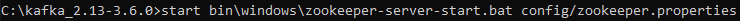
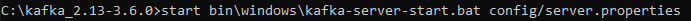
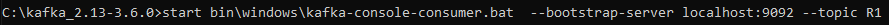
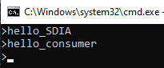
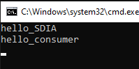
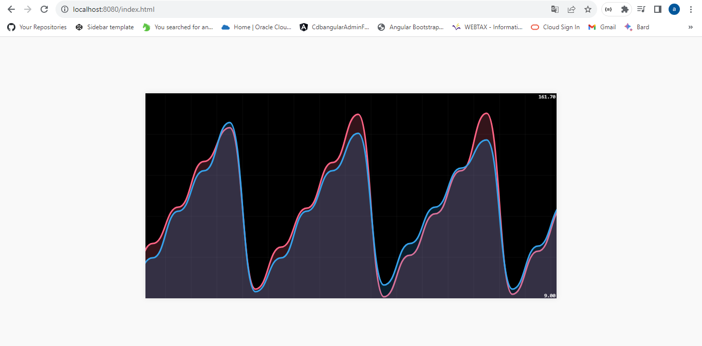

#  Event Driven Architecture

```
This project provides a demonstration of how Spring Cloud services can be effectively incorporated with Apache Kafka,
empowering the development of resilient applications built around event-driven architectural principles.

```
### Testing KAFKA Server

the process involves downloading Kafka, starting Zookeeper and Kafka server, and then testing the setup using Kafka-console-producer and kafka-console-consumer commands.

#### Zookeeper
<table>
    <tr>
        <td>
                <p align="center">
                    
                </p>
        </td>
    </tr>
</table>

#### KAFKA server
<table>
    <tr>
        <td>
                <p align="center">
                    
                </p>
        </td>
    </tr>
</table>

> Start a consumer Subscribing to a topic to consume messages.
<table>
    <tr>
        <td>
                <p align="center">
                    
                </p>
        </td>
    </tr>
</table>

> start a producer that start a topic
<table>
    <tr>
        <td>
                <p align="center">
                    
                </p>
        </td>
    </tr>
</table>

<table>
    <tr>
        <td>
                <p align="center">
                    
                </p>
        </td>
 <td>
                <p align="center">
                    
                </p>
        </td>
    </tr>
</table>

### Using Docker

> Creating Docker file 

```java
    version: '3'
        services:
        zookeeper:
        image: confluentinc/cp-zookeeper:7.3.0
        container_name: zookeeper
        environment:
        ZOOKEEPER_CLIENT_PORT: 2181
        ZOOKEEPER_TICK_TIME: 2000

        broker:
        image: confluentinc/cp-kafka:7.3.0
        container_name: broker
        ports:
        # To learn about configuring Kafka for access across networks see
        # https://www.confluent.io/blog/kafka-client-cannot-connect-to-broker-on-aws-on-docker-etc/
        - "9092:9092"
        depends_on:
        - zookeeper
        environment:
        KAFKA_BROKER_ID: 1
        KAFKA_ZOOKEEPER_CONNECT: 'zookeeper:2181'
        KAFKA_LISTENER_SECURITY_PROTOCOL_MAP: PLAINTEXT:PLAINTEXT,PLAINTEXT_INTERNAL:PLAINTEXT
        KAFKA_ADVERTISED_LISTENERS: PLAINTEXT://localhost:9092,PLAINTEXT_INTERNAL://broker:29092
        KAFKA_OFFSETS_TOPIC_REPLICATION_FACTOR: 1
        KAFKA_TRANSACTION_STATE_LOG_MIN_ISR: 1
        KAFKA_TRANSACTION_STATE_LOG_REPLICATION_FACTOR: 1
```
> Starting docker containers: zookeeper and kafka-broker
> 
`docker exec --interactive --tty broker kafka-console-consumer --bootstrap-server broker:9092 --topic R1`

`docker exec --interactive --tty broker kafka-console-producer --bootstrap-server broker:9092 --topic R2`

### Using KAFKA and Spring Cloud Streams

> KAFKA Service Producer via a Rest Controller
>
```java
@GetMapping("/publish/{topic}/{name}")
public PageEvent publish(@PathVariable String topic,@PathVariable String name){
        PageEvent pageEvent=new PageEvent(name,Math.random()>0.5?"USER1":"USER2",new Date(),new Random().nextInt(9000));
        streamBridge.send(topic,pageEvent);
        return pageEvent;

        }
```

> KAFKA Consumer Service
>
```java
    @Bean
    public Consumer<PageEvent> PageEventConsumer(){
        return (input)->{
            System.out.println("***********");
            System.out.println(input.toString());
            System.out.println("***********");
        };
    }
```

> KAFKA Supplier Service
>
```java
    @Bean
    public Supplier<PageEvent> PageEventSupplier(){
        return ()->new PageEvent(
                Math.random()>0.5?"P1":"P2",
                Math.random()>0.5?"USER1":"USER2",
                new Date(),
                new Random().nextInt(9000)

        );
    }
```

> Real Time Stream Processing Data Analytics Service with Kaflka Streams
>
```java
     @Bean
public Function<KStream<String, PageEvent>, KStream<String, Long>> kStreamFunction(){
        return (input)->{
        return input
        .filter((k,v) -> v.getDuration()>100)
        .map((k,v) -> new KeyValue<>(v.getName(), 0L))
        .groupBy((k,v) -> k, Grouped.with(Serdes.String(), Serdes.Long()))
        .windowedBy(TimeWindows.of(Duration.ofMillis(5000)))
        .count(Materialized.as("count-pages"))
        .toStream()
        .map((k,v) -> new KeyValue<>(k.window().startTime() + " =To=> " + k.window().endTime() + " , page : " + k.key() , v));
        };
        }
```

> web application that allows you to display Stream Data Analytics results in real time
>
<table>
    <tr>
        <td>
                <p align="center">
                    
                </p>
        </td>
    </tr>
</table>
